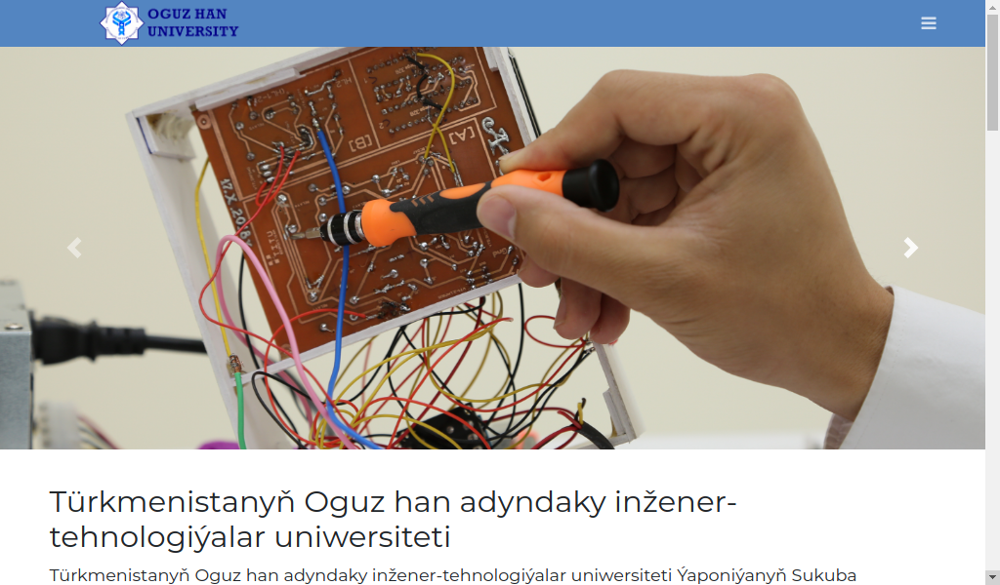
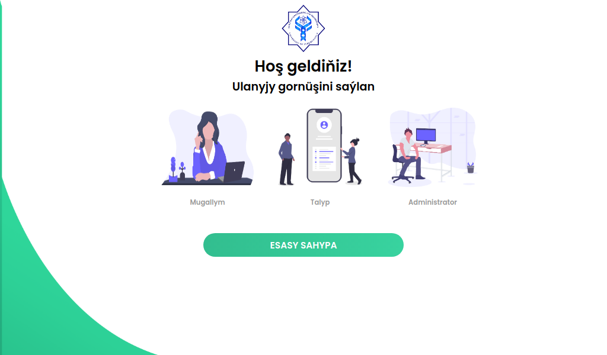

# LMS
Learning Management System Web App

> Authors:

+ Leyli Atayeva
+ Muhammed Jepbarov

**App Screenshots**




# Installation and usage

> install reuqired dependencies:

```bash
apt install python3-dev python3-venv python3-pip nginx gunicorn supervisor
```

> Create virtual environment:

```bash
python3 -m venv environment
source environment/bin/activate
```

> install required libraries using:

```bash
pip3 install -r requirements.txt
```

> Create script for running on boot:

**Location:** /etc/supervisor/conf.d/LMS.conf
```bash
[program:flaskblog]
directory=/home/**/LMS
command=/home/**/LMS/environment/bin/gunicorn -w 3 run:app
user=**
autostart=true
autorestart=true
stopasgroup=true
killasgroup=true
```

```bash
supervisorctl reload
systemctl restart nginx
```


> Create nginx server configuration

**Location:** /etc/nginx/sites-enabled/LMS
```bash
server {
        listen 80;
        server_name 0.0.0.0;

        location /static {
                alias /home/**/LMS/main/static;
        }

        location / {
                proxy_pass http://localhost:8000;
                include /etc/nginx/proxy_params;
                proxy_redirect off;
        }
}
```

> for migration or table Drop:

```bash
python3 migrate.py
```
## Usage:

> In the main screen get to admin page that is default:

**username:** administrator
**password:** lms_system@root/key

> Afterwards you can easily add/remove users (students and teachers)

> Student's page is accessed by entering the **Student ID** and **Password**

> Teacher's page is accessed by entering the **Username** and **Password**
